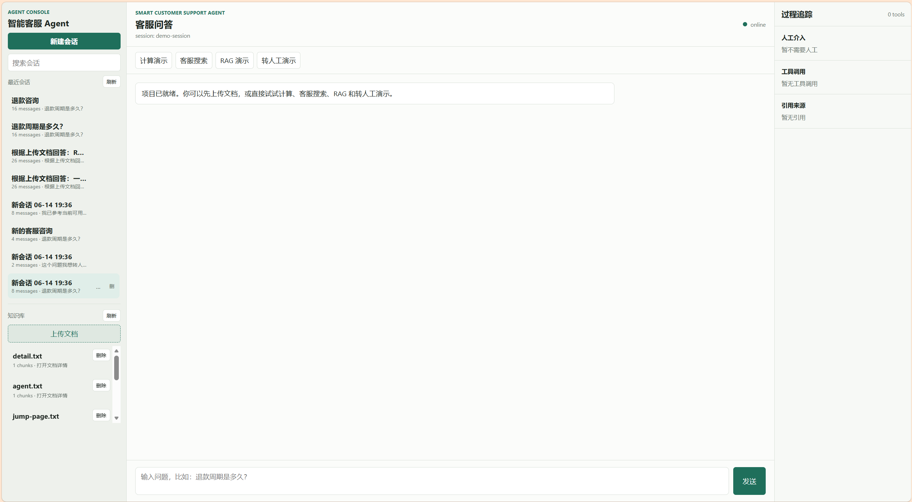
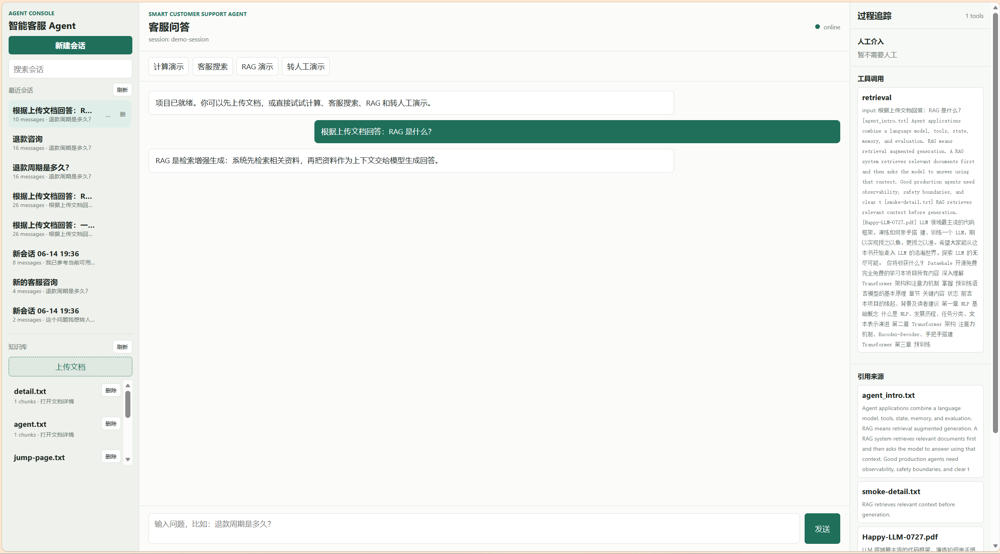
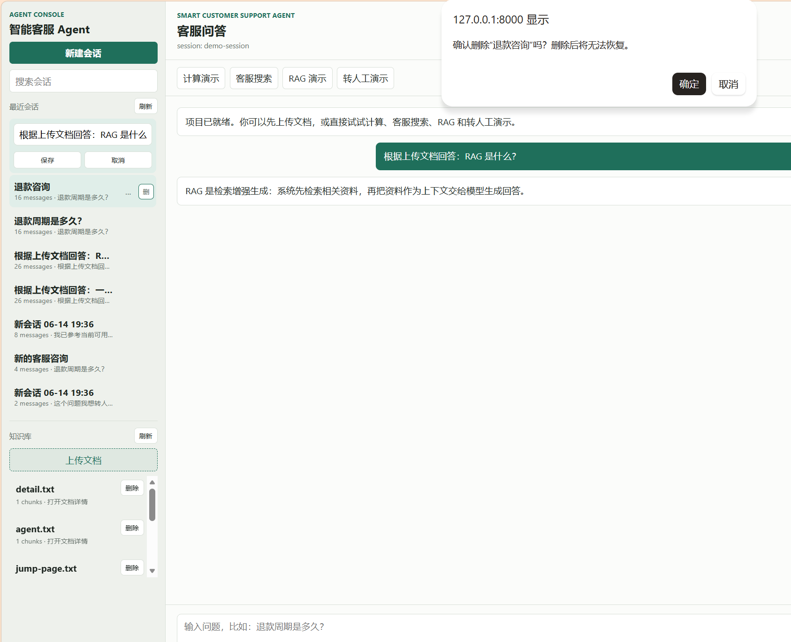
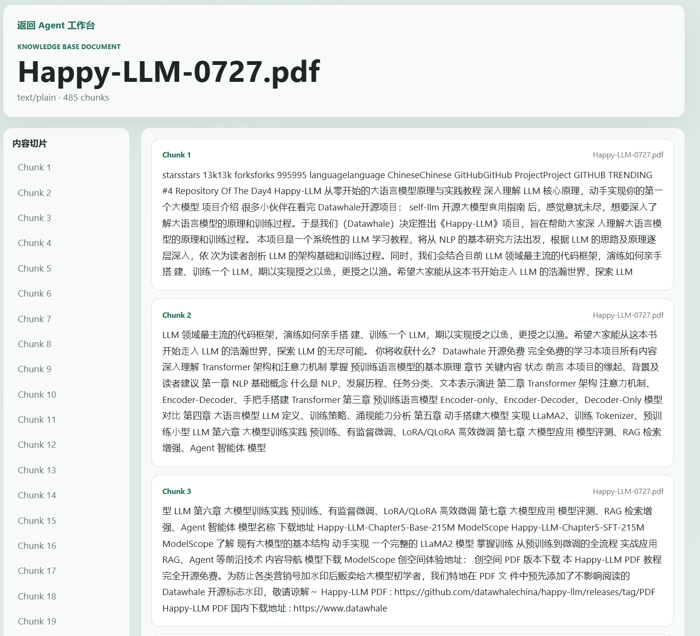

# Smart Customer Support Agent - Knowledge Agent

**RAG-Enabled Customer Support Agent**


`Smart Customer Support Agent` 是一个面向学习、演示和实习作品集的 Agent 项目，基于 `FastAPI + RAG + SQLite` 构建，将 **会话管理 / 文档上传 / 知识检索 / 工具调用 / 回答生成 / 持久化存储** 串成一个完整的可运行闭环。

It is not just a chat demo. It is a small but complete Agent MVP that shows how backend orchestration, retrieval, session state, and a usable frontend can work together in one project.

**核心入口**

- [`/`](http://127.0.0.1:8000/)：前端演示页面，负责会话、问答、文档上传与知识库查看
- [`/docs`](http://127.0.0.1:8000/docs)：Swagger API 文档
- [`docs/DEVELOPMENT.md`](docs/DEVELOPMENT.md)：开发文档，负责讲清楚架构、目录职责与部署流程

**快速导航**

- [功能特性](#features)
- [为什么做这个项目](#why)
- [核心架构](#architecture)
- [Demo 场景](#demo)
- [技术栈](#stack)
- [仓库结构](#structure)
- [本地开发](#dev)
- [Docker 与部署](#deploy)
- [环境变量](#env)
- [当前边界](#scope)
- [为什么适合作为简历项目](#resume)

---

<a id="features"></a>

## 功能特性

- **多会话管理**：支持创建、重命名、删除会话，并持久化保存历史消息
- **知识库上传与解析**：支持 `.txt`、`.md`、`.csv`、`.json`、`.pdf`
- **RAG 问答链路**：支持 `upload -> chunk -> retrieve -> answer -> citations`
- **工具路由**：内置 `calculator`、`search`、`retrieval`
- **双模式模型调用**：默认 `mock` 模式，也支持切换到真实 LLM 接口
- **前端可演示闭环**：支持聊天、知识库查看、文档详情查看
- **测试与评测**：支持 `pytest` 和 `evals.run_eval`
- **容器化部署**：支持 `Docker Compose`，并可接 `Nginx` 做公网访问

---

<a id="why"></a>

## 为什么做这个项目

这个项目的重点不在“堆一个很重的 Agent 框架”，而在于：

1. 把 **Agent 应用最核心的主链路** 做清楚
2. 把 **RAG 流程** 做成可解释、可引用、可演示的系统
3. 把 **会话状态、工具调用、知识库** 放进同一个产品体验里
4. 把 **本地开发 -> Docker -> 云服务器部署** 这条工程链路真正走通

它更像一个适合学习和讲解的 Agent MVP，而不是一个难以拆解的黑盒项目。

---

<a id="architecture"></a>

## 核心架构

这个项目可以理解为 5 层：

### 1. Frontend

负责用户交互：

- 提问与追问
- 会话切换
- 文档上传
- 文档详情查看
- 引用与回答展示

### 2. API Layer

由 `FastAPI` 提供 HTTP 接口，负责接收前端请求，返回结构化响应。

### 3. Service / Agent Layer

负责编排业务流程：

- 保存消息
- 路由工具调用
- 组装检索上下文
- 调用 mock 或真实模型

### 4. RAG Layer

负责知识库链路：

- 文档解析
- chunk 切分
- 数据入库
- 检索与引用输出

### 5. Persistence Layer

由 `SQLite + SQLAlchemy` 提供存储，保存：

- sessions
- messages
- documents
- document_chunks
- tool_calls
- eval_runs

整体链路如下：

```text
Frontend
   |
   v
FastAPI API
   |
   +--> Session / Message persistence
   +--> Document upload / parse / chunk / ingest
   +--> Tool routing
   +--> Retrieval
   +--> LLM or mock response
   |
   v
SQLite
```

---

## 项目截图

### Main Console



### RAG Answer With Citations



### Session Management



### Document Detail



---

<a id="demo"></a>

## Demo 场景

### Demo 1: 普通客服问答

输入：

```text
退款周期是多久？
```

展示点：

- 普通问答流程
- 工具路由到 `search`
- 返回可读回答

### Demo 2: 基于上传文档的 RAG 问答

先上传：

```text
sample_docs/agent_intro.txt
```

再提问：

```text
根据上传文档回答：RAG 是什么？
```

展示点：

- 文档入库
- 检索命中
- 回答附带 citations

### Demo 3: 会话管理与知识库查看

展示点：

- 新建、重命名、删除会话
- 左侧历史会话切换
- 点击文档进入详情页查看 chunk

---

<a id="stack"></a>

## 技术栈

### Backend

- FastAPI
- SQLAlchemy
- Pydantic
- SQLite

### Frontend

- HTML
- CSS
- Vanilla JavaScript

### RAG / File Processing

- pypdf
- text chunking
- keyword retrieval

### Engineering

- pytest
- Docker
- docker-compose
- Nginx

---

<a id="structure"></a>

## 仓库结构

```text
.
├── app/
│   ├── agent/
│   ├── api/
│   ├── core/
│   ├── db/
│   ├── llm/
│   ├── rag/
│   ├── schemas/
│   ├── services/
│   ├── static/
│   └── tools/
├── docs/
├── evals/
├── sample_docs/
├── tests/
├── docker-compose.yml
├── Dockerfile
├── requirements.txt
└── README.md
```

---

<a id="dev"></a>

## 本地开发

### Option A: Python 本地运行

```powershell
cd D:\knowledge-agent
python -m venv .venv
.\.venv\Scripts\Activate.ps1
python -m pip install -r requirements.txt
uvicorn app.main:app --reload
```

默认入口：

- Web UI: [http://127.0.0.1:8000/](http://127.0.0.1:8000/)
- API Docs: [http://127.0.0.1:8000/docs](http://127.0.0.1:8000/docs)

### Option B: Docker 运行

```powershell
docker compose up --build
```

---

<a id="deploy"></a>

## Docker 与部署

### 本地容器运行

```powershell
docker compose up --build
```

### 云服务器部署思路

推荐链路：

```text
GitHub -> 云服务器 -> Docker Compose -> Nginx -> 公网访问
```

当前项目已经验证过的部署方式：

- Ubuntu 云服务器
- Docker + docker-compose
- Nginx 反向代理到 `8000`
- 通过公网 IP 访问页面

如果要看更细的开发说明，可以继续读：

- [docs/DEVELOPMENT.md](docs/DEVELOPMENT.md)

---

<a id="env"></a>

## 环境变量

项目默认使用 `mock` 模式，因此不开真实模型也能直接跑通：

```env
OPENAI_API_KEY=
OPENAI_BASE_URL=
USE_REAL_LLM=false
MODEL=gpt-4.1-mini
DEBUG=true
DATA_DIR=data
DATABASE_URL=sqlite:///data/knowledge_agent.db
```

如果要切换到真实模型接口：

```env
USE_REAL_LLM=true
OPENAI_API_KEY=your_api_key
OPENAI_BASE_URL=your_base_url
MODEL=your_model_name
```

说明：

- `USE_REAL_LLM=false`：走 mock 回答，适合本地开发、测试和低成本演示
- `USE_REAL_LLM=true`：走真实模型接口
- `OPENAI_BASE_URL`：支持 OpenAI 兼容接口，不限于官方 OpenAI

---

<a id="scope"></a>

## 当前边界

当前项目最适合展示的是：

- 基础 Agent 应用架构
- RAG 主链路
- 会话管理
- 文档上传与知识库查看
- Docker 与云服务器部署

以下部分还没有做成企业级版本：

- 多用户登录鉴权
- 向量数据库检索
- 权限隔离
- 限流与防刷
- 复杂工作流编排
- 后台管理系统

这不是缺点，反而说明它是一个边界清晰的 MVP。

---

<a id="resume"></a>

## 为什么适合作为简历项目

这个项目的价值在于，它不是单点功能，而是一条完整的工程链路：

- 既有后端接口和数据库设计
- 也有 RAG 和工具调用
- 既有前端交互，也有部署实践
- 既能讲产品流程，也能讲技术实现

如果要一句话概括：

> 这是一个基于 FastAPI、SQLite 和 RAG 的智能客服知识库 Agent 项目，支持多会话管理、文档检索问答、工具调用与 Docker 部署，具备完整的开发、测试和上线闭环。

---

## 路线图

- 从关键词检索升级到 embedding 检索
- 将 SQLite 升级到 PostgreSQL + pgvector
- 增加登录鉴权和多用户隔离
- 增加更完整的管理后台
- 支持更丰富的模型接入方式

---

## 许可说明

本项目当前使用 [MIT License](LICENSE)。
